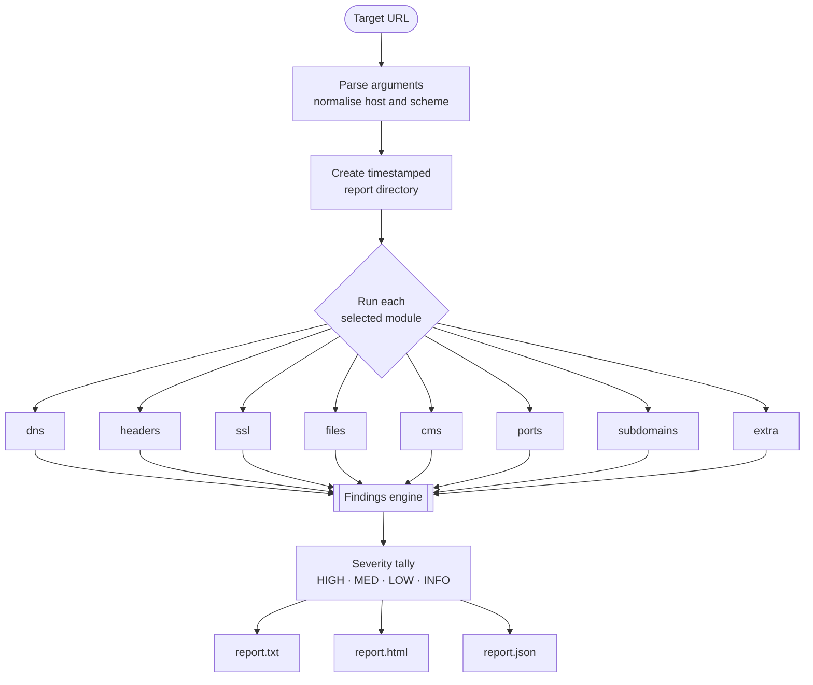

# VulnX — Overview

Everything about what VulnX is, how it works under the hood, and what each part does. This is the reference doc; the [README](README.md) is the short version.

---

## What it is

VulnX is a website reconnaissance and vulnerability assessment scanner written entirely in Bash. It's a single script, `vulnx.sh`, that you point at a domain. It runs eight focused security checks one after another, grades everything it finds by severity, and writes the results out in three formats.

I built it to collapse the repetitive early phase of a security assessment — the part where you'd otherwise open a dozen tabs and run a dozen separate tools just to understand a target — into one command that produces a clean, shareable result.

There's no runtime to install and no configuration file. It leans on the standard command-line tools most Linux systems already have, and when an optional tool is missing it skips that one check instead of failing the whole run.

---

## What it looks at

VulnX is organised into eight modules. By default all of them run; you can also select a subset.

| Module | What it inspects |
| :--- | :--- |
| `dns` | A / NS / MX records, the WHOIS registrar and expiry, and whether SPF and DMARC email-authentication records exist |
| `headers` | HTTP security headers (HSTS, CSP, X-Frame-Options, and more), cookie flags (`Secure`, `HttpOnly`, `SameSite`), and technology disclosure via `Server` / `X-Powered-By` |
| `ssl` | The TLS certificate's validity and days-to-expiry, plus whether the server still accepts deprecated protocols (SSLv2/3, TLS 1.0/1.1) |
| `files` | Common sensitive paths — `.git/config`, `.env`, `.htaccess`, backup archives, `phpinfo.php`, exposed admin panels, and similar |
| `cms` | Fingerprints WordPress, Joomla, and Drupal from the page source, and notes JavaScript library versions such as jQuery |
| `ports` | An nmap sweep of the top ports, flagging risky exposed services (FTP, Telnet, RDP, MySQL, Redis, MongoDB) |
| `subdomains` | Discovers subdomains from public certificate-transparency logs via crt.sh |
| `extra` | Real-world exploit-surface probes — see the breakdown below |

### The `extra` module in detail

This is the module that goes beyond passive linting. It runs eight active checks:

1. **CORS misconfiguration** — sends a bogus `Origin` and sees whether the server reflects it back, and whether it also allows credentials (which turns reflection into cross-origin data theft).
2. **Dangerous HTTP methods** — an `OPTIONS` request reveals whether `TRACE`, `PUT`, or `DELETE` are enabled.
3. **Open redirect** — tries common redirect parameters (`redirect`, `url`, `next`, `return`, `dest`, `continue`) to see if an external URL is reflected into the `Location` header unvalidated.
4. **Mixed content** — on HTTPS pages, counts resources still loaded over plain `http://`.
5. **Directory listing** — checks whether directories like `/uploads/` expose a full file index.
6. **Exposed emails** — scrapes email addresses from the page source (a phishing/spam target surface).
7. **robots.txt leakage** — reads `Disallow` paths and tests whether those "hidden" paths are actually reachable anyway.
8. **WAF / CDN detection** — identifies Cloudflare, Sucuri, Akamai, and AWS from response fingerprints, so you can interpret the other results in context.

---

## How it works

At a high level, VulnX flows in a straight line: parse the target, dispatch each selected module, funnel every result through one findings engine, then render that collected data into three reports.



### Step by step

1. **Argument parsing.** The script reads your flags, and normalises the target — adding `https://` if you left the scheme off, and pulling out the bare hostname for DNS and port lookups.
2. **Setup.** It creates a per-run output folder named `reports/<host>_<timestamp>/` so results never overwrite each other, and initialises an empty findings file.
3. **Module dispatch.** Each selected module runs in turn. A module first checks that its tool exists; if not, it logs a note and returns rather than erroring.
4. **The findings engine.** Every check reports through a single `finding` function. It takes a severity, the module name, a title, and a detail. That function bumps the matching severity counter and appends a pipe-delimited line to the raw findings file. This is the one place all results converge, which is what keeps the running tally and the three reports perfectly in sync.
5. **Report generation.** After the last module, that raw findings file is read three times — once to render plain text, once to build the styled HTML, and once (via a short embedded Python step) to emit JSON.
6. **Summary.** Finally it prints the severity totals to the terminal and the paths to the three reports.

### Severity model

Every finding carries one of four levels, which is what lets you triage the output at a glance:

| Level | Meaning |
| :--- | :--- |
| `HIGH` | Act on it — exposed data, weak or expired crypto, dangerous open ports |
| `MED` | Should be fixed — missing hardening that raises real risk |
| `LOW` | Worth tightening — minor hygiene issues |
| `INFO` | Context, not a problem — disclosed technology, discovered subdomains |

---

## Running it

The only required input is a target URL:

```bash
./vulnx.sh -u https://example.com
```

Full option list:

```
-u, --url <url>        Target URL. The only required flag.
-o, --outdir <dir>     Where reports are written (default: ./reports)
-p, --ports <n>        How many top ports to scan (default: 100)
-m, --modules <list>   Comma-separated modules to run (default: all)
    --json             Suppress the colored logs and print JSON only
-h, --help             Show the help screen
```

Some representative runs:

```bash
# Full sweep
./vulnx.sh -u https://example.com

# Just the fast web-layer checks, no port scan
./vulnx.sh -u example.com -m headers,ssl,extra

# Wider port scan into a custom folder
./vulnx.sh -u example.com -p 1000 -o ./client-audit

# Machine-readable output, piped into jq
./vulnx.sh -u example.com --json | jq '.summary'
```

The port scan and subdomain lookup are the two slowest modules — drop them from `-m` when you want a quick pass.

---

## What you get back

Each run produces a self-contained folder:

```
reports/
└── example.com_20260812_101500/
    ├── report.txt         Plain-text summary — quick to read and grep
    ├── report.html        Styled report — open it in a browser
    ├── report.json        Structured data for your own tooling
    ├── raw_headers.txt     Full HTTP response headers
    ├── nmap_scan.txt       Raw port-scan output
    ├── ssl_cert.txt        Certificate details
    └── subdomains.txt      Discovered subdomains (if any)
```

- **`report.txt`** — the same findings you saw in the terminal, in plain text.
- **`report.html`** — a dark-themed, self-contained page with severity cards and a findings table, suitable for handing to a client.
- **`report.json`** — the target, a UTC timestamp, the severity summary, and the full findings array, ready to feed into other tools.

Pull a slice out of the JSON like this:

```bash
# List only the HIGH-severity findings
./vulnx.sh -u example.com --json | jq '.findings[] | select(.severity=="HIGH")'
```

---

## What it needs

`bash`, `curl`, and `python3` are the essentials — everything else is optional and only affects the module that uses it.

| Tool | Used by | Required? |
| :--- | :--- | :--- |
| `bash` | Runs the script | Yes |
| `curl` | Most modules | Yes |
| `python3` | JSON report | Yes |
| `openssl` | `ssl` | Optional |
| `dig` | `dns` | Optional |
| `whois` | `dns` | Optional |
| `nmap` | `ports` | Optional |

The bundled `install.sh` checks for these and installs whatever is missing on Debian, Ubuntu, and Kali.

---

## Design choices

A few decisions worth calling out, since they shape how the tool behaves:

- **One file.** Keeping everything in `vulnx.sh` means you can copy it to any box and run it — no packaging, no dependency tree of its own.
- **Graceful degradation.** Optional tools are checked at the top of each module, so a machine without nmap still gets seven modules' worth of results.
- **One findings path.** Because every result flows through the same function, the terminal tally, the text report, the HTML, and the JSON can never disagree.
- **Passive by default.** The checks are lightweight requests, not aggressive exploitation — the goal is to map and grade the surface, not to break it.

---

## Responsible use

VulnX is for education and **authorized** security testing only. Only scan systems you own or have explicit written permission to test. Unauthorized scanning can be illegal under the IT Act 2000 (India), the CFAA (USA), the Computer Misuse Act (UK), and equivalent laws elsewhere. How you use it is your responsibility.

---

Built and maintained by **Tanmay Sune**.
