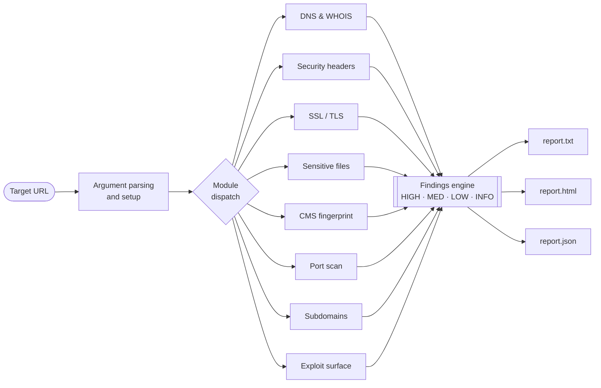

<div align="center">


<br>

**A single-file Bash toolkit that maps a website's attack surface and grades its security posture in one pass.**

<br>

[](https://www.gnu.org/software/bash/)
[](#requirements)
[](vulnx.sh)
[](#license)

</div>

---

## About

VulnX is a website reconnaissance and vulnerability assessment scanner I wrote to replace the ten-tab, ten-tool routine I kept repeating on every engagement. Point it at a domain and it runs eight focused checks back to back — DNS and WHOIS, HTTP security headers, TLS configuration, sensitive-file exposure, CMS fingerprinting, an nmap port sweep, certificate-transparency subdomain discovery, and a set of real-world exploit-surface probes (CORS, dangerous HTTP methods, open redirects, mixed content, directory listing, and more).

Everything lives in one portable script. No runtime to install, no config file to babysit, no dependencies beyond the standard command-line tools most boxes already ship with. When it finishes you get the same findings in three formats — a colored terminal summary, a clean HTML report you can hand to a client, and machine-readable JSON for your own tooling.

> **Authorized testing only.** Scan systems you own or have explicit written permission to test. See [Legal & responsible use](#legal--responsible-use).

## Demo

<div align="center">



</div>

## Highlights

- **One command, eight modules** — run the full sweep or cherry-pick exactly the checks you want with `-m`.
- **Findings that are actually triaged** — every result is tagged `HIGH` / `MED` / `LOW` / `INFO`, so the noise sorts itself.
- **Three reports, one run** — terminal, HTML, and JSON written to a timestamped folder per target.
- **Real exploit-surface probes** — not just header linting: reflected-Origin CORS, `TRACE`/`PUT`/`DELETE`, open redirects, mixed content, exposed backups, and WAF/CDN detection.
- **Degrades gracefully** — a missing optional tool skips its module with a note instead of crashing the run.
- **Portable by design** — a single Bash file you can drop onto any Linux box.

## How it works



Each module reports through a single findings engine that keeps a running severity tally. Once every selected module has run, that same collected data is rendered into all three report formats.

## Quick start

```bash
# 1. Get the code
git clone https://github.com/Tanmaysune/VulnX.git
cd VulnX

# 2. Install dependencies (once)
./install.sh

# 3. Run your first scan
./vulnx.sh -u https://example.com
```

Want the full picture — every module, how the internals fit together, and the design choices behind them? It's all in **[OVERVIEW.md](OVERVIEW.md)**.

## Usage

```
Usage: ./vulnx.sh -u <target_url> [options]

Required:
  -u, --url <url>          Target URL (e.g. https://example.com)

Options:
  -o, --outdir <dir>       Report output directory (default: ./reports)
  -p, --ports <n>          Number of top ports to scan (default: 100)
  -m, --modules <list>     Comma-separated modules to run (default: all)
                           Available: dns,headers,ssl,files,cms,ports,subdomains,extra
      --json               Machine-readable mode: suppress colored logs
  -h, --help               Show this help message
```

A few common runs:

```bash
# Full sweep
./vulnx.sh -u https://example.com

# Just the fast web checks — no port scan
./vulnx.sh -u example.com -m headers,ssl,extra

# Wider port scan into a custom folder
./vulnx.sh -u example.com -p 1000 -o ./client-audit

# Pipe JSON straight into jq
./vulnx.sh -u example.com --json | jq '.summary'
```

## Modules

| Module | What it checks | Typical severity |
| :--- | :--- | :--- |
| `dns` | A / NS / MX records, WHOIS registrar, missing SPF and DMARC | LOW / INFO |
| `headers` | HSTS, CSP, X-Frame-Options and friends, cookie flags, tech disclosure | MED / LOW |
| `ssl` | Certificate validity and expiry, deprecated SSL/TLS protocol support | HIGH / MED |
| `files` | Exposed `.git`, `.env`, backups, `.htaccess`, admin panels | HIGH / INFO |
| `cms` | WordPress / Joomla / Drupal fingerprinting, JS library versions | INFO |
| `ports` | nmap top-ports sweep flagging risky services (RDP, MySQL, Redis…) | HIGH / MED |
| `subdomains` | Subdomain discovery via certificate-transparency logs (crt.sh) | INFO |
| `extra` | CORS, dangerous HTTP methods, open redirects, mixed content, dir listing, WAF/CDN | HIGH / MED / LOW |

## Reports

Every run creates `reports/<host>_<timestamp>/` containing:

| File | Format | Use it for |
| :--- | :--- | :--- |
| `report.txt` | Plain text | Quick terminal review and grep |
| `report.html` | Styled HTML | A shareable, client-ready summary |
| `report.json` | JSON | Feeding results into other tools and pipelines |

Supporting evidence — raw headers, the nmap output, the certificate details, and any discovered subdomains — is saved alongside those reports.

## Requirements

`bash`, `curl`, and `python3` are the essentials. The rest are optional — VulnX skips a module (with a note) when its tool is absent.

| Tool | Needed for | Install |
| :--- | :--- | :--- |
| `curl` | Nearly every module | usually preinstalled |
| `openssl` | SSL/TLS checks | `apt install openssl` |
| `dig` | DNS enumeration | `apt install dnsutils` |
| `whois` | Registrar lookup | `apt install whois` |
| `nmap` | Port scanning | `apt install nmap` |
| `python3` | JSON report generation | `apt install python3` |

`./install.sh` checks for these and installs what's missing on Debian, Ubuntu, and Kali.

## Legal & responsible use

VulnX is built for education and **authorized** security testing. Only scan targets you own or have explicit written permission to assess. Unauthorized scanning can be illegal under the IT Act 2000 (India), the CFAA (USA), the Computer Misuse Act (UK), and equivalent laws elsewhere. You are responsible for how you use this tool.

## License

Released under the MIT License — see [LICENSE](LICENSE) if included, or use freely with attribution.

## Author

Built and maintained by **Tanmay Sune**.
